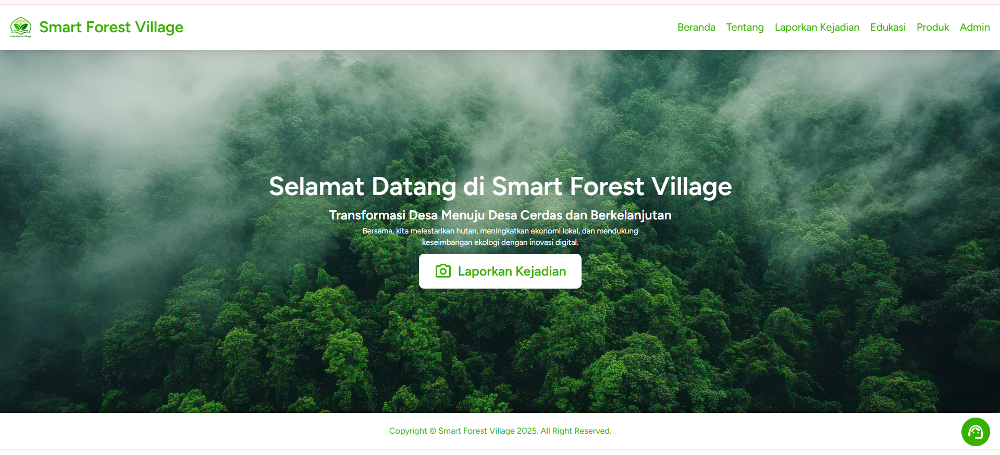

SmartVillage adalah sebuah sistem informasi berbasis web yang dikembangkan untuk meningkatkan transparansi dan partisipasi publik dalam proses pelaporan di lingkungan desa. Aplikasi ini dirancang khusus untuk mendukung kebutuhan pelaporan warga desa kepada pemerintah desa secara mudah, cepat, dan efisien.

Proyek ini dikembangkan dalam rangka partisipasi pada program Innovillage 2024, dengan mengangkat isu transformasi digital di desa sebagai fokus utama.

🚀 Fitur Utama
📢 Pelaporan publik secara online oleh warga

📂 Manajemen laporan oleh admin desa

📊 Dashboard interaktif untuk monitoring laporan

📱 Responsif, bisa diakses dari perangkat mobile maupun desktop

🛠️ Teknologi yang Digunakan
Backend: Laravel (PHP Framework)

Frontend: React.js melalui Inertia.js
Filament: untuk pengembangan dashboard interaktif

Database: MySQL/MariaDB

Authentication: Laravel Breeze

📌 Tujuan Proyek
Proyek ini bertujuan untuk:

Mendorong partisipasi aktif masyarakat desa dalam pelaporan masalah

Menyediakan sistem manajemen laporan yang modern bagi perangkat desa

Menjadi solusi digital yang mudah diterapkan di berbagai desa di Indonesia

### 📷 Tampilan Antarmuka

